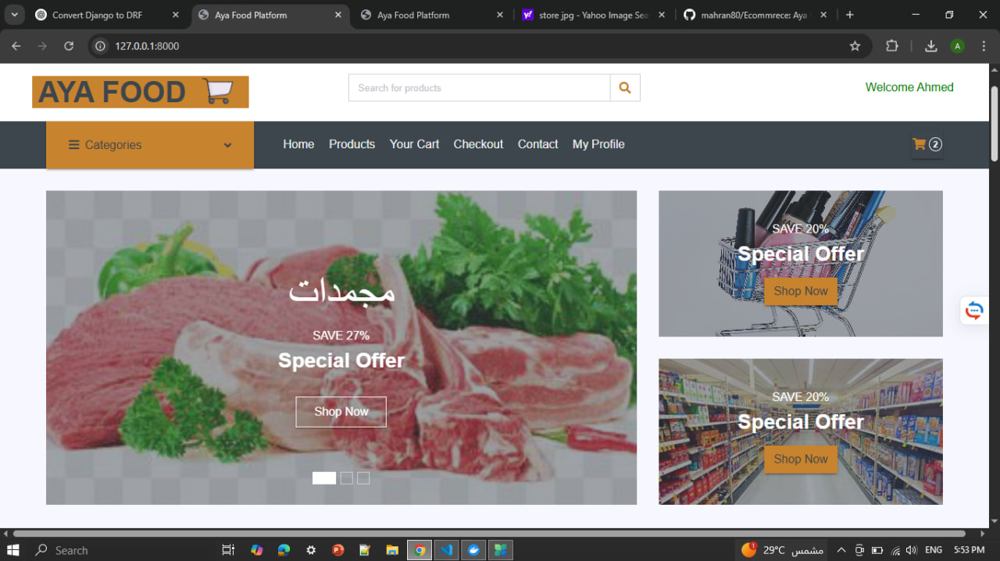
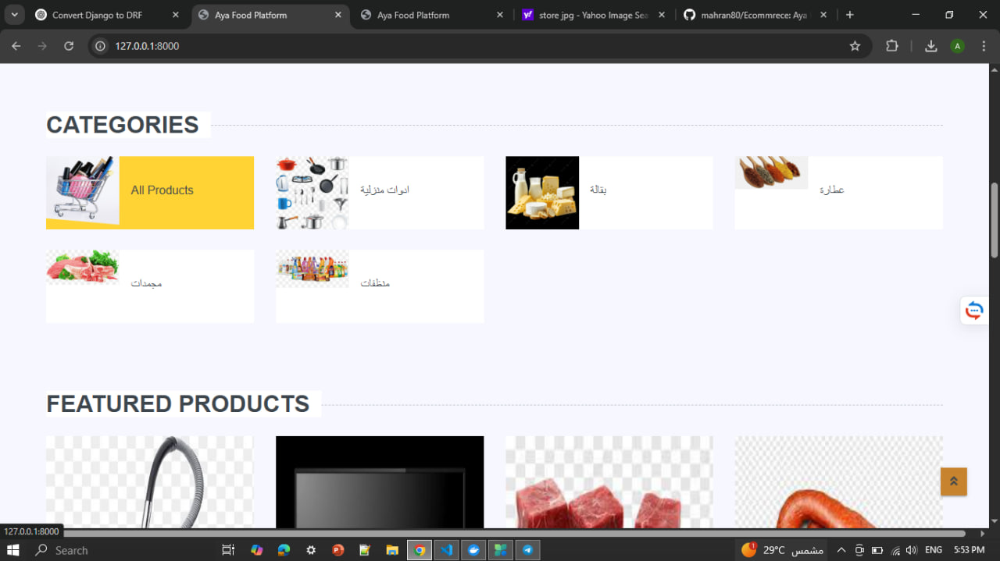
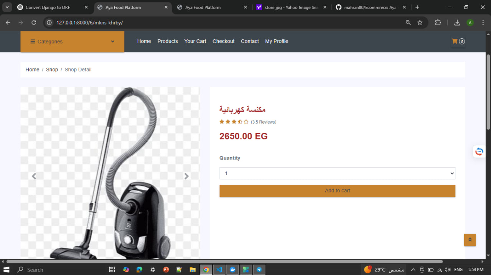
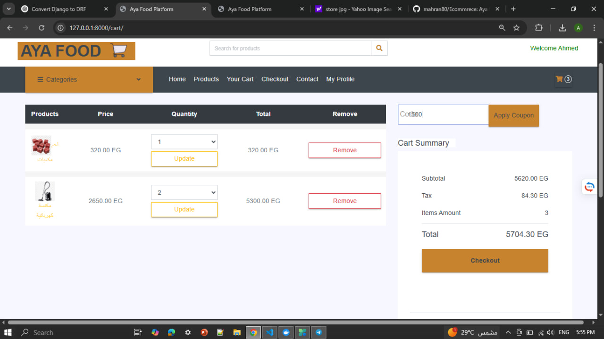
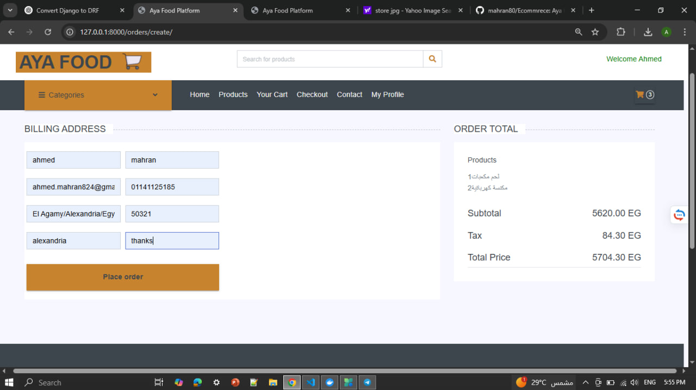
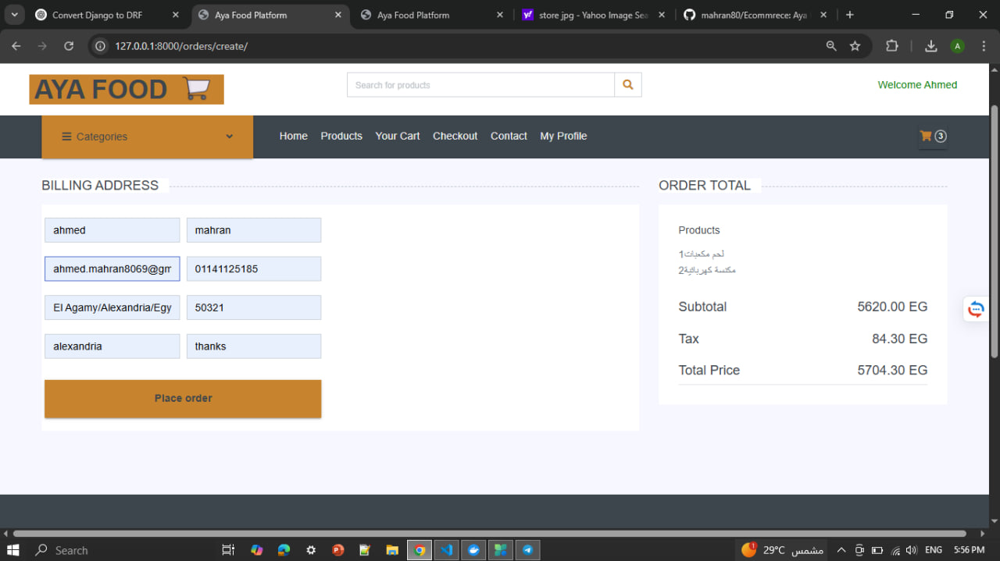
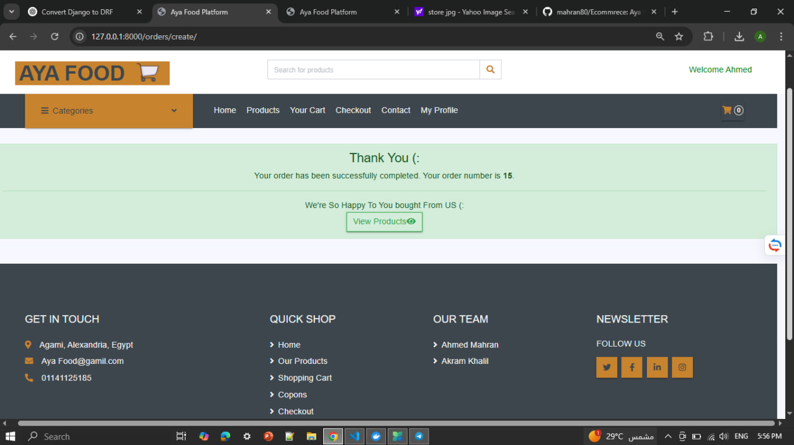
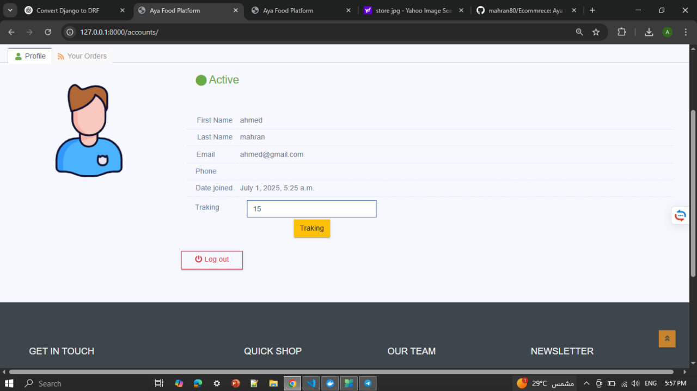
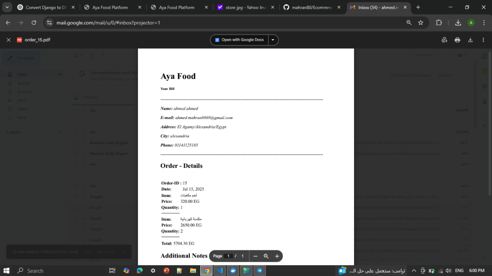

```markdown
# 🛒 Aya Food – Django Ecommerce Platform

This is a full-featured ecommerce web application built with **Django**. It supports product management, user authentication, shopping cart, order processing, coupon system, contact form, seller dashboard, and background task processing using **Celery**, **Redis**, and **RabbitMQ**.

---
## 📸 Screenshots

<p align="center">
  
  
  
  
  
  
  
  
  
</p>


## 📦 Features

- 🛍️ Product listing with filtering & pagination  
- 🔍 Product detail with related products  
- 🧾 Shopping cart functionality  
- 🧑‍💻 Seller registration & dashboard  
- 💳 Checkout and order confirmation system  
- 🎟️ Coupon discount support  
- 📬 Contact form with email integration  
- ✅ Email verification & password reset flows  
- 📡 Background task handling with Celery  
- 🧠 PostgreSQL database  
- 📤 Email sending via SMTP  
- 🧊 Redis and RabbitMQ integration for async tasks  

---

## 🚀 Live Demo

Coming Soon...

---

## 🛠️ Technologies Used

- **Backend Framework**: Django  
- **Database**: PostgreSQL  
- **Email Backend**: Gmail SMTP  
- **Asynchronous Tasks**: Celery + Redis + RabbitMQ  
- **Frontend**: HTML, CSS, Bootstrap (via Django templates)  
- **Deployment Ready**: Designed for production with modular apps  
- **Others**: Pillow, Django Messages Framework, Sessions, CSRF Protection  

---

## 📁 Project Structure

```

Ecommerce\_rest/
│
├── backend/
│   ├── accounts/          # User registration & login
│   ├── cart/              # Cart logic (session-based)
│   ├── contactus/         # Contact form & email sender
│   ├── coupons/           # Discount system
│   ├── orders/            # Order model and checkout logic
│   ├── seller/            # Public seller registration
│   ├── seller\_account/    # Seller dashboard & product management
│   ├── store/             # Main product/catalog logic
│   ├── backend/           # Project settings, URLs, celery config
│   ├── templates/         # Global templates
│   └── static/            # CSS, JS, images
│
└── venv/                  # Python virtual environment

````

---

## 🧪 Installation & Setup

Follow these steps to set up the project locally:

---

### 1️⃣ Clone the Repository

```bash
git clone https://github.com/mahran80/Ecommrece.git
cd Ecommrece
````

---

### 2️⃣ Create & Activate Virtual Environment

```bash
python -m venv venv
# Windows
venv\Scripts\activate
# macOS/Linux
source venv/bin/activate
```

---

### 3️⃣ Install Requirements

```bash
cd backend
pip install -r requirements.txt
```

---

### 4️⃣ Run Migrations

```bash
python manage.py makemigrations
python manage.py migrate
```

---

### 5️⃣ Create Superuser (Admin Panel)

```bash
python manage.py createsuperuser
```

---

### 6️⃣ Run Development Server

```bash
python manage.py runserver
```

Now visit: [http://127.0.0.1:8000](http://127.0.0.1:8000)

---

## 🔧 Required Services

To fully run the project and all background tasks (e.g., sending emails, async actions), make sure the following services are running:

---

### 🔄 Redis (as message broker / backend)

```bash
redis-server
```

---

### 📨 RabbitMQ (Celery broker)

```bash
# Linux
sudo service rabbitmq-server start

# Or with Docker
docker run -d --hostname rabbit --name rabbitmq -p 5672:5672 -p 15672:15672 rabbitmq:3-management
```

RabbitMQ Admin Panel: [http://localhost:15672](http://localhost:15672)
Default login: `guest` / `guest`

---

### ⚙️ Celery Worker

```bash
# Inside backend/
celery -A backend worker --loglevel=info
```

---

## 🔒 Environment Variables

Optional `.env` variables you can set:

```env
EMAIL_HOST_USER=your_email@gmail.com
EMAIL_HOST_PASSWORD=your_app_password
SECRET_KEY=your_django_secret
DEBUG=True
```

---

## 🛡️ .gitignore

Create a `.gitignore` file in your root with the following:

```
venv/
__pycache__/
*.pyc
db.sqlite3
*.log
*.pot
*.pyc
*.pyo
*.pyd
media/
static/
.env
.env.*
.idea/
*.sqlite3
celerybeat-schedule
```

---

## 🗂️ Git Commands

```bash
git init
git remote add origin https://github.com/mahran80/Ecommrece.git
git add .
git commit -m "Initial commit: Aya Food Django ecommerce"
git branch -M main
git push -u origin main
```

---

## 📬 Contact

For any questions or contributions, feel free to open an issue or contact me on GitHub.

---

## 📄 License

This project is licensed under the [MIT License](LICENSE).

```

---

Let me know if you want me to also generate:
- `requirements.txt`
- `LICENSE`
- a DRF version of this README later

You're all set to commit and push this file! ✅
```

